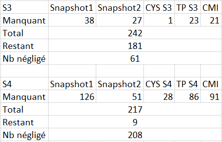

```{r setup, include=FALSE}
knitr::opts_chunk$set(echo = TRUE)
```

```{r,echo=F}
library(ggplot2)
library(gridExtra)
library(ggfortify)
library(leaps)
library(MASS)
library(ggplot2)
```

# Etude des données 

## Les données

```{r}
CYS3 = read.csv("Semestre3_Complet.csv")
summary(CYS3)
```
```{r}
N=242
table(CYS3$CYS.S3)/N*100
#pie(table(CYS3$CYS.S3))
```
Commentaire:

On trouve que presque un tier des étudiants utilisent l'outil CheckYourSmile en semestre 3. 
```{r}
table(CYS3$CMI)/N*100
#pie(table(CYS3$CMI))
```
Commentaire:

On trouve que presque 15% des étudiants sont CMI en semestre 3. Or, presque 9% des étudiants ne donnent pas de réponse. 
```{r}
table(CYS3$TP.S3)/N*100
#pie(table(CYS3$TP.S3))
```
Commentaire:

On trouve que presque 64% des étudiants pratiquent les TP en français en semestre 3 et 26% pratiquent les TP en anglais. Or, presque 10% des étudiants ne donnent pas de réponse. 


Commentaire:

On trouve que presque un tier

```{r, eval=F}
library(gmodels)
CrossTable(CYS3$CYS.S3,CYS3$CMI)
CrossTable(CYS3$CYS.S3,CYS3$TP.S3)
CrossTable(CYS3$CMI,CYS3$TP.S3)
```


```{r}
CYS = read.csv("DonneeS3_filtre.csv")
summary(CYS)
```


```{r}
#  Stat. descriptives à completer
boxplot(CYS$snapshot.1,CYS$snapshot.2,names=c("Snapshot1","Snapshot2"), ylab="Résultat",
        main="Résultats au Snapshot1 et au Snapshot2")
```

Au regard de boxplot, on constate que le Snapshot2 prend souvent les valeurs plus grandes que le Snapshot1 d'où la progresson obtenue en résultat.

```{r}
#  Stat. descriptives à completer
ks.test(CYS$snapshot.1,CYS$snapshot.2,alternative = "greater")
```

La p_valeur associée au test Kolmogrov est inférieure à 0,05 donc on accepte que les étudiants ont des notes de Snapshot2 plus élevé que Snapshot1.  


```{r}
#  Stat. descriptives à completer
boxplot(CYS$snapshot.2~CYS$CYS.S3,names=c("Non utilisé","Utilisé"), 
        ylab="Résultat Snapshot2 en S3", 
        main=" Résultat Snapshot2 en S3 selon l'utilisation de CYS en S3")
```

```{r}
#  Stat. descriptives à completer
dif_snap=CYS$snapshot.2-CYS$snapshot.1
ratio_snap=CYS$snapshot.2/CYS$snapshot.1
boxplot(dif_snap~CYS$CYS.S3, ylab="Différence de résultat entre Snapshot1 et  
        Snapshot2 en S3", 
        main=" Différence de résultat entre Snapshot1 et  
        Snapshot2 en S3 selon l'utilisation de CYS en S3")
boxplot(ratio_snap~CYS$CYS.S3, ylab="Ratio de résultat entre Snapshot1 et  Snapshot2 
        en S3", 
        main=" Ratio de résultat entre Snapshot1 et  Snapshot2 
        en S3 selon l'utilisation de CYS en S3")
```

```{r}
#  Stat. descriptives à completer
boxplot(dif_snap~CYS$CMI, ylab="Différence de résultat entre Snapshot1 et  Snapshot2 en S3", 
        main=" Différence de résultat entre Snapshot1 et  Snapshot2 en S3 selon CMI en S3")
```
```{r}
#  Stat. descriptives à completer
boxplot(ratio_snap~CYS$CMI, ylab="Ratio de résultat entre Snapshot1 et  Snapshot2 en S3",
        main=" Ratio de résultat entre Snapshot1 et  Snapshot2 en S3 selon CMI en S3")
```


Remarque: On observe peu d'évolution entre les résultats de Snapshot1 et Snapshot2. Il vaut donc mieux considérer un modèle avec plusieurs variables.

# Test d'un modèle ANOVA de 3 facteurs(CYS S3, CMI, TP S3)


```{r}
# A completer
mod1=lm(dif_snap~(CYS$CYS.S3+CYS$TP.S3+ CYS$CMI)^2,data=CYS)
summary(mod1)
```

```{r}
# A completer - fonction lm
#step.backward = step(mod1)
```
Selon le test d'AIC, on trouve le meilleur modèle modAIC1: 

$$ dif\_ snap \sim CYS\$CYS.S3 + CYS\$TP.S3 + CYS\$CMI + CYS\$CYS.S3:CYS\$CMI $$
```{r}
# A completer
modAIC1=lm(dif_snap ~ CYS$CYS.S3 + CYS$TP.S3 + CYS$CMI + CYS$CYS.S3:CYS$CMI,data=CYS)
summary(modAIC1)
anova(modAIC1,mod1)
```
La p_valeur de Test Fisher est 0,2854 supérieure que 0,05 donc on accepte le modèle modAIC1.

```{r}
#step.backward = step(mod1,direction="backward",k=log(nrow(CYS)))
```
Selon le test d'BIC, on trouve le meilleur modèle: 

$dif\_snap \sim CYS\$CYS.S3 + CYS\$CMI + CYS\$CYS.S3:CYS\$CMI$

```{r}
# A completer
modBIC1=lm(dif_snap ~ CYS$CYS.S3 + CYS$CMI + CYS$CYS.S3:CYS$CMI,data=CYS)
anova(modBIC1,mod1)
```
La p_valeur de Test Fisher est 0,105 supérieure que 0,05 donc on accepte le modèle modBIC1.
```{r}
# A completer
anova(modBIC1,modAIC1)
```
La p_valeur de Test Fisher est 0,105 supérieure que 0,05 donc on accepte le modèle modBIC1.


```{r}
# A completer
mod2=lm(ratio_snap~(CYS$CYS.S3+CYS$TP.S3+ CYS$CMI)^2,data=CYS)
summary(mod1)
```


```{r}
#step.backward = step(mod2,direction="backward",k=log(nrow(CYS)))
```
Selon le test d'BIC, on trouve le meilleur modèle modBIC2: 

$ratio\_snap \sim CYS\$CMI$

De même façon, on trouve le meilleur modèle pour modéliser le ratio_snap:


```{r}
# A completer
modBIC2=lm(ratio_snap ~ CYS$CMI,data=CYS)
summary(modBIC2)
anova(modBIC2,mod2)
```
La p_valeur de Test Fisher est 0,31 supérieure que 0,05 donc on accepte le modèle modBIC1.

Remarque: Grâce au test ANOVA on trouve que:

- Si on considère la différence entre les deux snapshots on obtient le modèle


$dif\_snap \sim CYS\$CYS.S3 + CYS\$CMI + CYS\$CYS.S3:CYS\$CMI$


Cela montre l'impact de CMI et CYS S3 sur l'évolution de résultat.

- SI on considère la ratio entre les deux snapshots on obtient le modèle 


$ratio\_snap \sim CYS\$CMI$


Cela montre l'impact de CMI S3 sur l'évolution de résultat.

Dans ces deux cas on ne trouve pas l'effet de la variable TP S3.


# Test d'un modèle ANCOVA de 3 facteurs qualitatives (CYS S3, CMI, TP S3) et 1 facteur quantitative(Snapshot1) pour modéliser le Snapshot2

On souhaite expliquer le Snapshot2 en fonction du Snapshot1, des choix (de la langue de TP, l'utilisation de CMI et celle de CYS) en S3. On met en place un modèle d'analyse de la covariance. 

```{r}
# A completer
modR=lm(CYS$snapshot.2 ~ (CYS$snapshot.1+CYS$TP.S3+CYS$CYS.S3+ CYS$CMI)^2,data=CYS)
summary(modR)
```

```{r}
# A completer
#step.backward = step(modR,direction="backward",k=log(nrow(CYS)))
```

```{r}
# A completer
modbest=lm(CYS$snapshot.2 ~ CYS$snapshot.1 + CYS$TP.S3 + CYS$CYS.S3 + CYS$CMI + 
    CYS$CYS.S3:CYS$CMI,data=CYS)
summary(modbest)
anova(modbest,modR)
```
Selon le test d'BIC, on trouve le meilleur modèle modBIC2: 

$CYS\$snapshot.2 \sim CYS\$snapshot.1 + CYS\$TP.S3 + CYS\$CYS.S3 + CYS\$CMI + CYS\$CYS.S3:CYS\$CMI$

En fait, on veut estimer le résultat de Snapshot2 par le modèle:
$$
(modbest): Snapshot2_{ijkl}  = \mu + \alpha Snapshot1_{ijkl} + \beta_{i} + \gamma_j + \theta_k + \delta_{jk} +\varepsilon_{ijkl},\, \forall i=1, \, 2,\, \forall j=1,2, \forall k=1,2
$$
où:

i,j,k sont les indices de modalité pour les variables qualitatives TP.S3, CYS.S3 et CMI, respectivement.(1 pour la réponse Non et 2 pour la réponse Oui, dans le cas de TP 1 pour FR et 2 pour GB)

L'indice ijkl est pour indiquer l'individu l-ième ayant des modalités i,j,k pour TP.S3, CYS.S3 et CMI, respectivement. 
$\varepsilon_{ijkl}$ est des erreurs de l'estimation de l'individu ayant l'indice ijkl.

D'où:
$$
\mu=4.62384 \\
\alpha=0.56912\\
\beta_{1}= \gamma_1 = \theta_1 = \delta_{11}= \delta_{12}== \delta_{21}=0\\
\beta_{2}=1.90361\\
\gamma_2=0.43506\\
\delta_{22}=-3.02652
$$

## Train+ Test par le modèle ANCOVA

### Train

```{r}
n <- nrow(CYS) 
trainIndices <- sample(n, size = 2 * n / 3)
train <- CYS[trainIndices, ]
test <- CYS[-trainIndices, ]
```

### Test

```{r}
m0=lm(snapshot.2 ~ snapshot.1 + TP.S3 + CYS.S3 + CMI + 
    CYS.S3:CMI,data=train)
p <- predict(m0, newdata = test, type = "response")
table(p) 
#p0<-(CYS$snapshot.2)[-trainIndices]
p0<-test$snapshot.2
SCR=norm(p-p0,type="2")^2
SCT=norm(p0-mean(p0),type="2")^2
Rajustee<-1-SCR/SCT
Rajustee
#norm(p,type="2")
```

```{r ggplotresidussimple}
autoplot(modbest)
```

Vérifions les 4 hypothèses pour ce modèle:

Hypothèse H1 : Les erreurs sont centrées

Hypothèse H2 : La variance des erreurs est constante

Hypothèse H3 : Les résidus sont indépendantes

Hypothèse H4 : Les données suivent des lois gaussiennes

- Les résidus sont situés aléatoirement sur les deux côtés de 0. Or, on ne trouve pas la forme bannane ni la forme trompette, donc on peut déduire que H1 et H2 sont vérifiées

- On observe dans le graphe Residuals vs Fitted aucun phénomène de pacquets sur les côtés de 0 donc H3 est vérifiée.

- Au regard du graphe Normal Q-Q, on constate que les résidus suivent une loi gaussienne. Ainsi, H4 est vérifiée.

# Abre binaire de régression

```{r}
library(rpart) # chargement de la librairie
data3=CYS[,c(4,5,7,9,11)]
data3[,"CYS_CMI"]=(data3[,"CYS.S3"]=="oui")*(data3[,"CMI"]=="oui")
data3[,"CYS_CMI"]=as.factor(data3[,"CYS_CMI"])
data3[,"CYS_TP"]=(data3[,"CYS.S3"]=="oui")*(data3[,"TP.S3"]=="GB")
data3[,"CYS_TP"]=as.factor(data3[,"CYS_TP"])
data3[,"TP_CMI"]=(data3[,"TP.S3"]=="GB")*(data3[,"CMI"]=="oui")
data3[,"TP_CMI"]=as.factor(data3[,"TP_CMI"])
data3[,"CYS_CMInon"]=(data3[,"CYS.S3"]=="oui")*(data3[,"CMI"]=="non")
data3[,"CYS_CMInon"]=as.factor(data3[,"CYS_CMInon"])
data3[,"CYS_TPFR"]=(data3[,"CYS.S3"]=="oui")*(data3[,"TP.S3"]=="FR")
data3[,"CYS_TPFR"]=as.factor(data3[,"CYS_TPFR"])
data4=data3
data4[,"eval"]=data4[,"snapshot.2"]-data4[,"snapshot.1"]
data4=data4[,c(3,4,5,6,7,8,9,10,11)]
summary(data3)
summary(data4)
tree.reg3=rpart(snapshot.2~.,data=data3,control=rpart.control(cp=0.001))
tree.reg4=rpart(eval~.,data=data4,control=rpart.control(cp=0.001))
```

```{r}
#plot(tree.reg3)
#text(tree.reg3)
```

```{r}
library(partykit)
xmat3=xpred.rpart(tree.reg3)
xerr3=(xmat3-data3[,"snapshot.2"])^2
CVerr3=apply(xerr3,2,sum)
xmat4=xpred.rpart(tree.reg4)
xerr4=(xmat4-data4[,"eval"])^2
CVerr4=apply(xerr4,2,sum)
#as.numeric(attributes(which.min(CVerr))$names)
#tree.reg3=rpart(snapshot.2~.,data=data3,control=rpart.control(cp=as.numeric(attributes(which.min(CVerr3))$names)))
#plot(as.party(tree.reg3), type="simple")
tree.reg4=rpart(eval~.,data=data4,control=rpart.control(cp=as.numeric(attributes(which.min(CVerr4))$names)))
plot(as.party(tree.reg4), type="simple")
```

Commentaire:

Au regard de l'arbre de régression, on trouve les résultats suivants:

- Un étudiant utilisant l'outil CYS, n'étant pas en CMI a des progressions en résultat moyen 2,739 et 4,176 si il a des TP en Français et en Anglais respectivement. (cf des feuilles 8,9)

- Un étudiant n'utilisant pas l'outil CYS et n'étant pas en CMI a des progressions en résultat moyen 1,986.(cf feuille 3)

- Un étudiant utilisant l'outil CYS, étant en CMI a des progressions en résultat moyen 1,75. (cf des feuilles 5)

- Un étudiant n'utilisant pas l'outil CYS, étant en CMI a des progressions en résultat moyen 4,125. (cf des feuilles 6)

Ainsi, un étudiant utilsant l'outil CYS mais n'étant pas en CMI a tendance de progresser mieux en comparaison avec un étudiant  n'utilisant pas l'outil CYS et n'étant pas en CMI.

Pourtant,un étudiant utilsant l'outil CYS mais étant en CMI a tendance de progresser moins en comparaison avec un étudiant  n'utilisant pas l'outil CYS et étant en CMI.

# Conclusion:

On a décidé de modéliser la note de Snapshot2 en fonction de Snapshot1, l'utilisation de l'outil CheckYourSmile, la langue de TP et le fait que l'étudiant est en CMI ou pas.

Alors, sous le modèle ANCOVA on a trouvé que les trois facteurs qualitatives ont des impactes sur le résultat Snapshot2. Or, le Snaphot1 a un gros effet sur le résultat de Snapshot2. On y trouve aussi un terme d'interaction entre la variable CYS.S3 et la variable CMI et celui dernier a un effet important négatif sur le Snapshot2.

ie, un étudiant en CMI utilisant l'outil Check Your Smile a tendance de dégrader environ 2,6 points (-3,02652+0,43506) et un étudiant non CMI utilisant l'outil Check Your Smile a tendance de progresser environ 0,4 points (0,43506)


On voit que le modèle ANCOVA nous donne un R-ajusté bien meilleur que le modèle ANOVA. (0,4615>>0,006 et 0,4615>>0,09)

Pourtant, l'analyse des donnée peut s'améliorer car on n'a gardé que 181 données en semestre 3 et 9 en semestre 4 sur 459 étudiants.




En semestre 4, les données ne sont pas assez bonnes:

- 126 individus n'ont pas de note de Snapshot1
- 51 individus n'ont pas de note de Snapshot2
- 28 individus ont des réponses invalidées si ils utilisent ou pas l'outil CYS (la valeur de réponse est soit BLANK soit ?)
- 86 individus ont des réponses invalidées de la langue pour TP (la valeur de réponse est soit non soit BLANK)
- 43 individus ont des réponses invalidées si ils sont CMI (la valeur de réponse est soit BLANK soit ? )
